**JVM核心技术**


目录

1. JVM 基础知识

2. Java 字节码技术

3. JVM 类加载器

4. JVM 内存模型

5. JVM 启动参数


## 字节码

```
java bytecode 由单字节(byte) 组成, 支持256个操作码

一个byte字节由8位组成, 2^8 = 256

JVM 是一台基于栈的计算机器

每个线程都有独立的线程栈, 存储栈帧

每次方法调用, JVM 都会自动创建一个栈帧

栈帧由操作数栈, 局部变量数组以及一个 Class 引用组成

Class 引用指向当前方法在运行时常量池中对应的 Class

java -g (localvariabletable)
```


**指令分类**

• 栈操作指令, 包括与局部变量交互的指令

• 程序流程控制指令

• 对象操作指令, 包括方法调用指令

• 算术运算以及类型转换指令 


**算数操作**

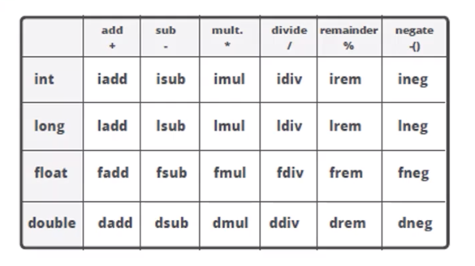

a表示对象引用 (aload、astore)

类型最小单位: int


**类型转换**

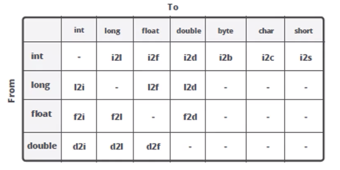


## **JVM 类加载**


**类的生命周期**

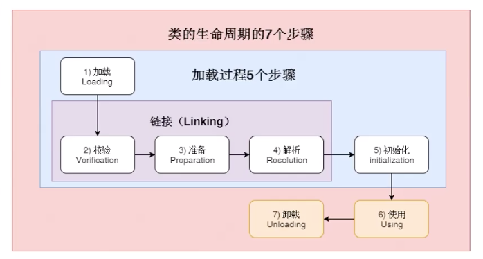

1. 加载: 找 Class 文件

2. 验证: 验证格式、依赖 (类与类引用关系)

3. 准备: 静态字段、方法表

4. 解析: 符号解析为引用

5. 初始化: 构造器、静态变量赋值、静态代码块


大体分为三步: 加载、链接、初始化


**类的加载时机**

```
1. 当虚拟机启动时, 初始化用户指定的主类, 就是启动执行的 main 方法所在的类;
2. 当遇到用以新建目标类实例的 new 指令时, 初始化 new 指令的目标类, 就是 new 一个类的时候要初始化;
3. 当遇到调用静态方法的指令时, 初始化该静态方法所在的类;
4. 当遇到访问静态字段的指令时, 初始化该静态字段所在的类;
5. 子类的初始化会触发父类的初始化;
6. 如果一个接口定义了 default 方法, 那么直接实现或者间接实现该接口的类的初始化, 会触发该接口的初始化;
7. 使用反射 API 对某个类进行反射调用时, 初始化这个类, 其实跟前面一样, 反射调用要么是已经有实例了, 要么是静态方法, 都需要初始化;
8. 当初次调用 MethodHandle 实例时, 初始化该 MethodHandle 指向的方法所在的类. (类似于函数指针, 用法和反射一样)
```


总结: new、静态、面向对象的子类继承、反射相关


**类不会初始化 (可能会加载)**

```
1. 通过子类引用父类的静态字段, 只会触发父类的初始化, 而不会触发子类的初始化;
2. 定义对象数组, 不会触发该类的初始化;
3. 常量在编译期间会存入调用类的常量池, 本质上并没有直接引用定义常量的类, 不会触发定义常量所在的类; (常量在编译期就存放在常量池);
4. 通过类名获取 Class 对象, 不会触发类的初始化, Hello.class 不会让 Hello 类初始化; (Hello类会被加载到内存)
5. 通过 Class.forName 加载指定类时, 如果指定参数 initialize 为 false 时, 也不会触发初始化, 其实这个参数是告诉虚拟机, 是否要对类进行初始化; (Class.forName(“jvm.Hello”)默认会加载 Hello 类)
6. 通过 ClassLoader 默认的 loadClass 方法, 也不会触发初始化动作 (加载了, 但不初始化)
```


**三类加载器**

1. 启动类加载器 (BootstrapClassLoader): 加载 JVM 最核心的依赖系统类, 如 rt.jar (包含java.util、java.lang 等)

2. 扩展类加载器 (ExtClassLoader): jdk可以配置”扩展类路径”目录, 会加载指定目录的 jar 或 class 文件

3. 应用类加载器 (AppClassLoader)


**加载器特点**

• 双亲委托

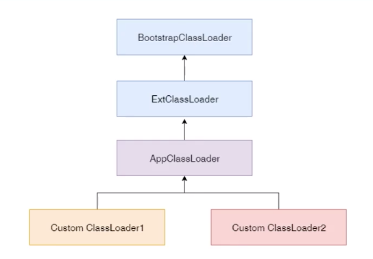

• 负责依赖: 加载一个类需要加载和它相关的类

• 缓存加载: 加载之后缓存起来, 下次遇到直接使用缓存


模块化: 用自定义加载器隔离代码


**加载器的继承关系**

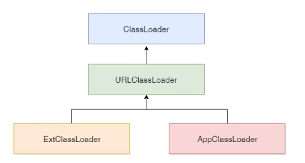


**显示当前 ClassLoader 加载了哪些 Jar**

```java
public class JvmClassLoaderPrintPath {

	public static void main(String[] args) {
		// 启动类加载器
		URL[] urls = sun.misc.LaunCher.getBootstrapClassPath().getURLs();
		System.out.println(“启动类加载器”);
		for(URL url : urls){
			System.out.println(“ ==> ” + url.toExternalForm());
		}

		// 扩展类加载器
		printClassLoader(“扩展类加载器”, JvmClassLoaderPrintPath.class.getClassLoader().getParent());

		// 应用类加载器
		printClassLoader(“应用类加载器”, JvmClassLoaderPrintPath.class.getClassLoader());

	}

	public static void printClassLoader(String name, ClassLoader CL){
		if(CL != null){
			System.out.println(name + “ ClassLoader -> ” + CL.toString());
			printURLForClassLoader(CL);
		}else{
			System.out.println(name + “ ClassLoader -> null“)
		}
	}

	public static void printURLForClassLoader(ClassLoader CL){
		Object ucp = insightField(CL, “ucp”);
		Object path = insightField(ucp, “path”);
		ArrayList ps = (ArrayList) path;
		for(Object p : ps){
			System.out.println(“ ==> “ + p.toString());
		}
	}

	private static Object insightField(Object obj, String fName){
		try {
			Field f = null;
			if(obj instanceof URLClassLoader){
				f = URLClassLoader.class.getDeclaredField(fName);
			}else{
				f = obj.getClass().getDeclaredField(fName);
			}
			f.setAccessible(true);
			return f.get(obj);
		} catch (Exception e) {
			e.printStackTrace();
			return null;
		}
	}
}
```


**添加引用类的几种方式**

1. 放到 JDK 的 lib/ext 下, 或者 -Djava.ext.dirs

2. java -cp/classpath 或者 class 文件放到当前路径

3. 自定义 ClassLoader 加载

4. 拿到当前执行类的 ClassLoader, 反射调用 addUrl 方法添加 Jar 或路径 (JDK9 无效)

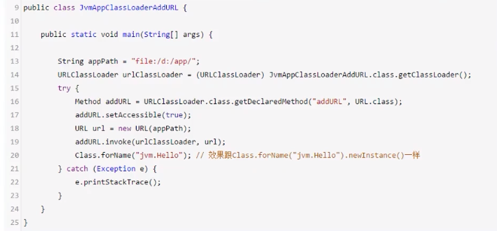


## JVM 内存


**JVM内存结构**

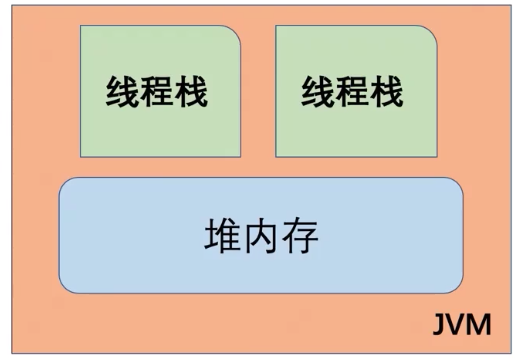

* 每个线程只能访问自己的线程栈
* 每个线程都不能访问(看不见) 其他线程的局部变量
* 所有原生类型的局部变量都存储在线程栈中, 因此对其他线程不可见
* 线程可以将一个原生变量值的副本传给另一个线程, 但不能共享原生局部变量本身 (线程中开启另一个线程, 并用 final 方式传参)
* 堆内存中包含了 Java 代码中创建的所有对象, 不管是哪个线程创建的, 其中也涵盖了包装类型 (例如 Byte, Integer, Long 等)
* 不管是创建一个对象并将其赋值给局部变量, 还是赋值给另一个对象的成员变量, 创建的对象都会被保存到堆内存中


附: 

```
基本类型分为2种： 

1.方法内的局部变量-原生类型； 

2.某个对象实例的成员变量。

对象的所有成员都位于堆内存。
方法内的局部变量，如果是基本类型，则存储空间就位于栈帧之中的局部变量表的某个槽位。【每个线程一份，只要调用到这个方法】
```


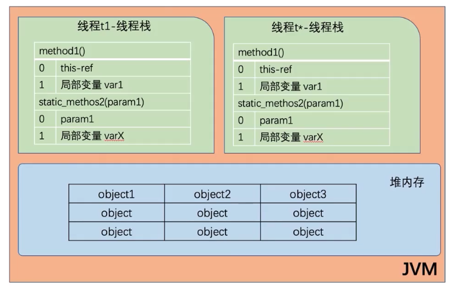

* 如果是原生数据类型的局部变量, 它的内容全部保留在线程栈上
* 如果是对象引用, 则栈中的局部变量槽位中保存这对象引用地址, 实际对象内容保存在堆中
* 对象的成员变量与对象本身一起存储在堆上, 不管成员变量的类型是原生数值, 还是对象引用
* 类的静态变量和类定义都保存在堆中


总结: 方法中的原生数据类型和对象引用地址在栈上存储; 对象、对象成员与类定义、静态变量在堆上 


**如果两个线程同时调用某个对象的同一方法, 则它们都可以访问到这个对象的成员变量, 但每个线程的局部变量副本是独立的** (栈对对象方法的成员变量, 以副本方式使用, 线程间副本独立)


**JVM 内存整体结构**

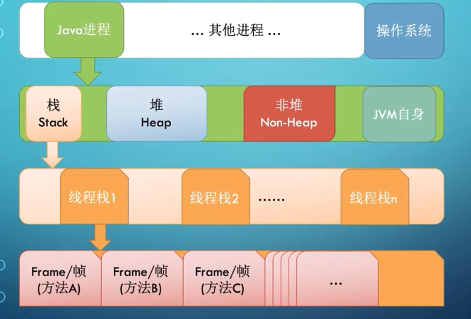

Xmx(最大堆内存) 的大小不超过系统总内存的 70%

• 非堆, 线程栈, 操作系统等会占用其他


**JVM 栈内存结构**

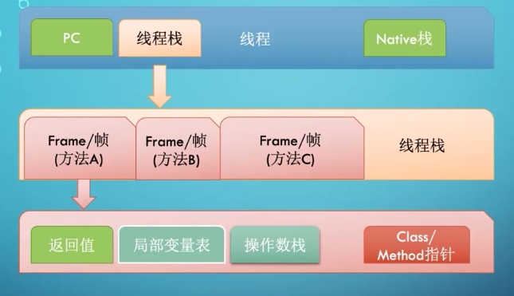

栈帧是逻辑概念, 具体大小在方法编写完成后基本确定


**JVM 堆内存结构**

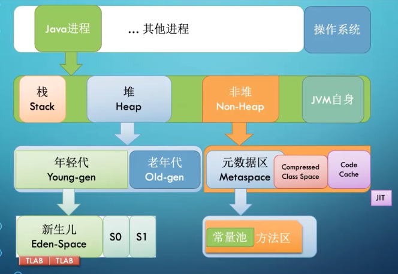

Compressed Class Space: 存放 class 信息, 和 Metaspace 有交叉

Code Cache: 存放 JIT 编译器编译后的本地机器代码


**CPU 与内存行为**

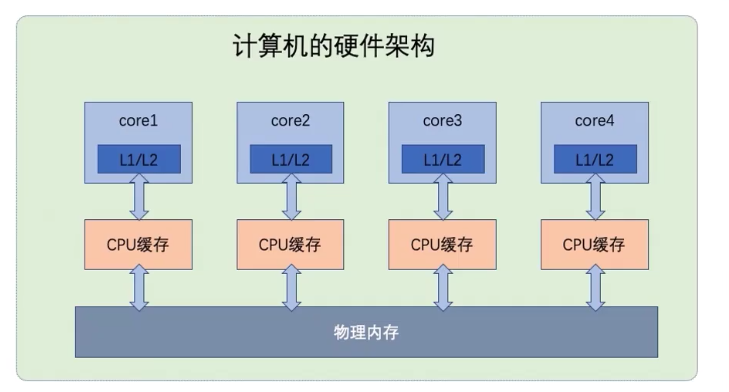

* CPU 乱序执行
* volatile 关键字
* 原子性操作
* 内存屏障


## **JVM 启动参数**

参数类型

1. -D: 系统属性 (环境变量)

2. -开头: JVM参数, 向下兼容

3. -X: JVM非标准参数

4. -XX: JVM非稳定参数