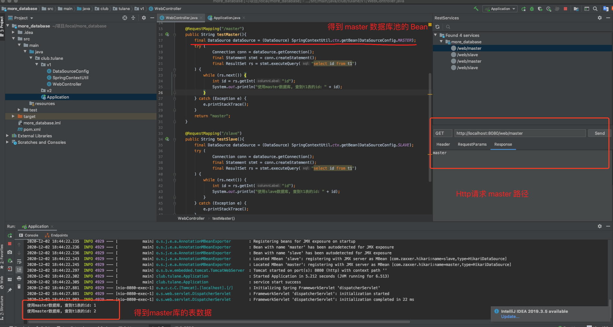
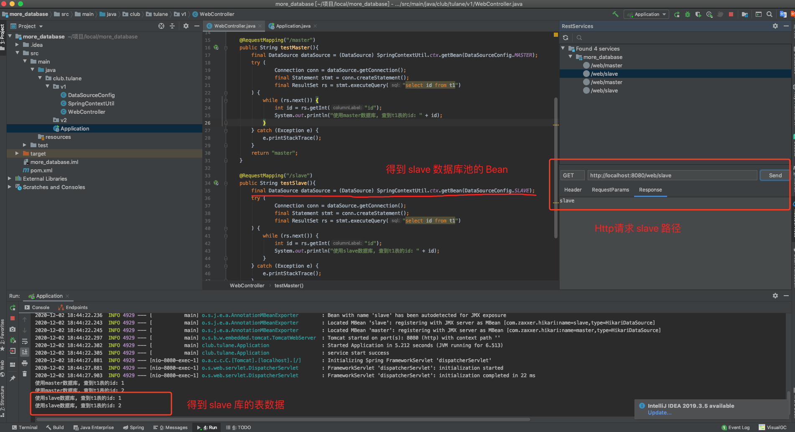
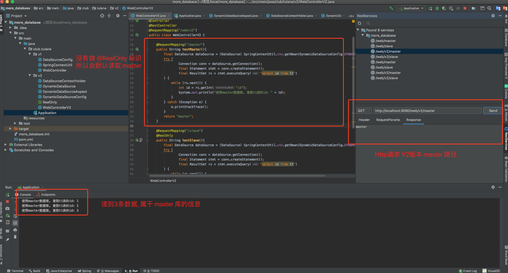
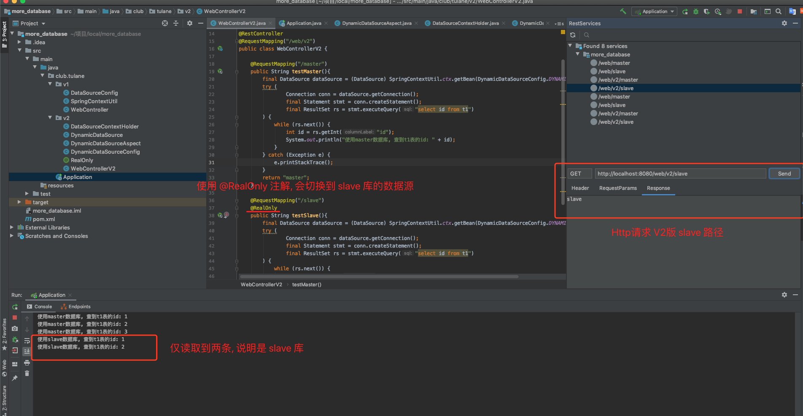
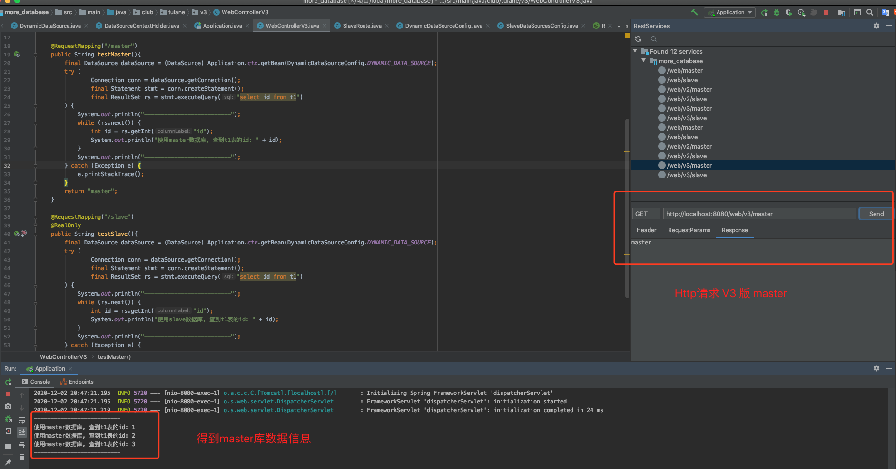
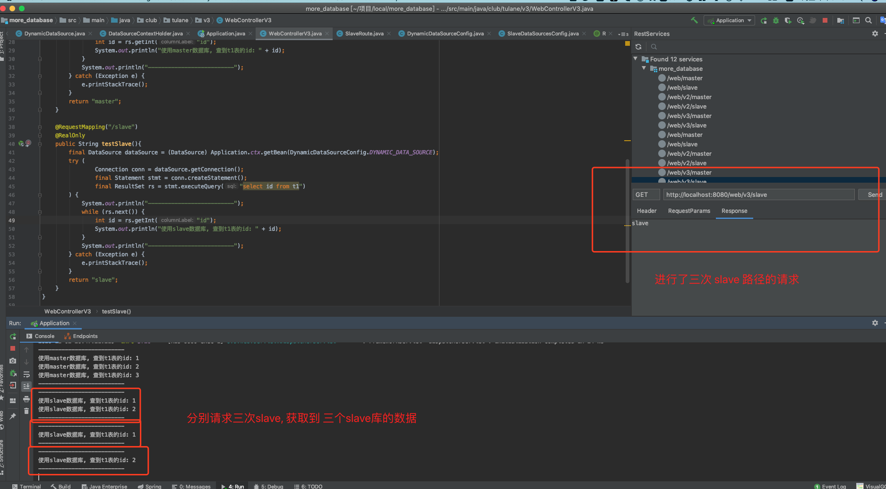

**Week07 作业题目（周六）：**


**2.（必做）读写分离 - 动态切换数据源版本 1.0**


## 第一个版本: 手动获取不同数据库连接池的Bean, 并建立连接使用

* master/slave 连接池配置

```java
package club.tulane.v1;

import com.zaxxer.hikari.HikariConfig;
import com.zaxxer.hikari.HikariDataSource;
import org.springframework.context.annotation.Bean;
import org.springframework.context.annotation.Configuration;

import javax.sql.DataSource;

@Configuration
public class DataSourceConfig {

    public static final String MASTER = "master";
    public static final String SLAVE = "slave";

    private static final String url_master = "jdbc:mysql://127.0.0.1:3316/db";
    private static final String url_slave = "jdbc:mysql://127.0.0.1:3317/db";
    private static final String user = "root";
    private static final String passwd = "123";

    @Bean(name = MASTER)
    public DataSource dataSource(){
        HikariConfig config = new HikariConfig();
        config.setJdbcUrl(url_master);
        config.setUsername(user);
        config.setPassword(passwd);
        config.setAutoCommit(false);
        config.addDataSourceProperty("cachePrepStmts", "true");
        config.addDataSourceProperty("prepStmtCacheSize", 300);
        return new HikariDataSource(config);
    }

    @Bean(name = SLAVE)
    public DataSource dataSourceSlave(){
        HikariConfig config = new HikariConfig();
        config.setJdbcUrl(url_slave);
        config.setUsername(user);
        config.setPassword(passwd);
        config.setAutoCommit(false);
        config.addDataSourceProperty("cachePrepStmts", "true");
        config.addDataSourceProperty("prepStmtCacheSize", 300);
        return new HikariDataSource(config);
    }
}
```


* 手动获得上下文中的Bean, 并建立连接查询数据

```java
package club.tulane.v1;

import org.springframework.stereotype.Controller;
import org.springframework.web.bind.annotation.RequestMapping;
import org.springframework.web.bind.annotation.RestController;

import javax.sql.DataSource;
import java.sql.*;

@Controller
@RestController
@RequestMapping("/web")
public class WebController {

    @RequestMapping("/master")
    public String testMaster(){
        final DataSource dataSource = (DataSource) SpringContextUtil.ctx.getBean(DataSourceConfig.MASTER);
        try (
                Connection conn = dataSource.getConnection();
                final Statement stmt = conn.createStatement();
                final ResultSet rs = stmt.executeQuery("select id from t1")
        ) {
            while (rs.next()) {
                int id = rs.getInt("id");
                System.out.println("使用master数据库, 查到t1表的id: " + id);
            }
        } catch (Exception e) {
            e.printStackTrace();
        }
        return "master";
    }

    @RequestMapping("/slave")
    public String testSlave(){
        final DataSource dataSource = (DataSource) SpringContextUtil.ctx.getBean(DataSourceConfig.SLAVE);
        try (
                Connection conn = dataSource.getConnection();
                final Statement stmt = conn.createStatement();
                final ResultSet rs = stmt.executeQuery("select id from t1")
        ) {
            while (rs.next()) {
                int id = rs.getInt("id");
                System.out.println("使用slave数据库, 查到t1表的id: " + id);
            }
        } catch (Exception e) {
            e.printStackTrace();
        }
        return "slave";
    }
}
```


* 测试结果如下:






## 第二个版本: 使用 AbstractRoutingDataSource, 用注解去切换

* 首先配置一个 ThreadLocal 的包装类, 用于区分隔离各个线程的使用的数据源 Bean 名称

```java
package club.tulane.v2;

import club.tulane.v1.DataSourceConfig;
import lombok.extern.slf4j.Slf4j;

@Slf4j
public class DataSourceContextHolder {

    public static final String default_datasource = DataSourceConfig.MASTER;

    private static final ThreadLocal<String> contextHolder = new ThreadLocal<>();

    /**
     * 切换数据源名
     * @param dbType
     */
    public static void setDB(String dbType) {
        log.debug("切换到{}数据源", dbType);
        contextHolder.set(dbType);
    }

    /**
     * 获取数据源名
     */
    public static String getDB() {
        return contextHolder.get();
    }

    /**
     * 清除数据源名
     */
    public static void clearDB() {
        contextHolder.remove();
    }
}
```


* 基于上个版本的 DataSourceConfig 的中两个数据源, 去配置一个包含多数据源的 AbstractRoutingDataSourcem

```java
package club.tulane.v2;

import org.springframework.jdbc.datasource.lookup.AbstractRoutingDataSource;

/**
 * 可动态调整最终返回的 DataSource 的数据源
 */
public class DynamicDataSource extends AbstractRoutingDataSource {

    /**
     * 返回的数据源 bean name, 为{@link DataSourceContextHolder}中的数据源名
     * @return
     */
    @Override
    protected Object determineCurrentLookupKey() {
        return DataSourceContextHolder.getDB();
    }
}
```


* 将此类配置为spring管理的 Bean, 作为我们实际使用中, 唯一使用的数据源

```java
package club.tulane.v2;

import club.tulane.v1.DataSourceConfig;
import org.springframework.beans.factory.annotation.Qualifier;
import org.springframework.context.annotation.Bean;
import org.springframework.context.annotation.Configuration;

import javax.annotation.Resource;
import javax.sql.DataSource;
import java.util.HashMap;
import java.util.Map;

/**
 * 动态数据源配置
 */
@Configuration
public class DynamicDataSourceConfig {

    public static final String DYNAMIC_DATA_SOURCE = "dynamicDataSource";

    @Resource
    @Qualifier(DataSourceConfig.MASTER)
    private DataSource masterDB;

    @Resource
    @Qualifier(DataSourceConfig.SLAVE)
    private DataSource slaveDB;

    @Bean(name = DYNAMIC_DATA_SOURCE)
    public DataSource dynamicDataSource() {
        DynamicDataSource dynamicDataSource = new DynamicDataSource();
        //设置默认数据源, 当 determineCurrentLookupKey() 方法获取的为空, 会使用此默认
        dynamicDataSource.setDefaultTargetDataSource(masterDB);

        Map<Object, Object> dsMap = new HashMap<>();
        dsMap.put(DataSourceConfig.MASTER, masterDB);
        dsMap.put(DataSourceConfig.SLAVE, slaveDB);
        dynamicDataSource.setTargetDataSources(dsMap);
        return dynamicDataSource;
    }
}
```


* 至此, 包含多数据源的唯一数据源已准备好, 隔离线程的数据源名称结构 (ThreadLocal) 也准备好了, 现在要写个注解, 用于区别方法内到底使用什么数据源

```java
package club.tulane.v2;

import club.tulane.v1.DataSourceConfig;

import java.lang.annotation.ElementType;
import java.lang.annotation.Retention;
import java.lang.annotation.RetentionPolicy;
import java.lang.annotation.Target;

@Retention(RetentionPolicy.RUNTIME)
@Target(ElementType.METHOD)
public @interface RealOnly {

    String value() default DataSourceConfig.SLAVE;
}
```


* 再实现最后一步, 利用spring aop, 去捕获写了自定义注解的方法, 自动切换 ThreadLocal 中的数据源名称, 这样, 动态数据源会根据此名称, 被动改变返回的数据源

```java
package club.tulane.v2;

import lombok.extern.slf4j.Slf4j;
import org.aspectj.lang.JoinPoint;
import org.aspectj.lang.annotation.After;
import org.aspectj.lang.annotation.Aspect;
import org.aspectj.lang.annotation.Before;
import org.aspectj.lang.reflect.MethodSignature;
import org.springframework.core.annotation.Order;
import org.springframework.stereotype.Component;

import java.lang.reflect.Method;

@Slf4j
@Aspect
@Order(-1)
@Component
public class DynamicDataSourceAspect {

    @Before("@annotation(RealOnly)")
    public void beforeSwitchDataSource(JoinPoint joinPoint){
        MethodSignature methodSignature = (MethodSignature) joinPoint.getSignature();
        Method method = methodSignature.getMethod();
        RealOnly realOnly = method.getDeclaredAnnotation(RealOnly.class);
        String dataSource = realOnly.value();
        DataSourceContextHolder.setDB(dataSource);
    }

    @After("@annotation(RealOnly)")
    public void afterSwitchDataSource(){
        DataSourceContextHolder.clearDB();
    }
}
```


* 最后, 实现Controller, 测试是否动态切换

```java
package club.tulane.v2;

import club.tulane.v1.SpringContextUtil;
import org.springframework.stereotype.Controller;
import org.springframework.web.bind.annotation.RequestMapping;
import org.springframework.web.bind.annotation.RestController;

import javax.sql.DataSource;
import java.sql.Connection;
import java.sql.ResultSet;
import java.sql.Statement;

@Controller
@RestController
@RequestMapping("/web/v2")
public class WebControllerV2 {

    @RequestMapping("/master")
    public String testMaster(){
        final DataSource dataSource = (DataSource) SpringContextUtil.ctx.getBean(DynamicDataSourceConfig.DYNAMIC_DATA_SOURCE);
        try (
                Connection conn = dataSource.getConnection();
                final Statement stmt = conn.createStatement();
                final ResultSet rs = stmt.executeQuery("select id from t1")
        ) {
            while (rs.next()) {
                int id = rs.getInt("id");
                System.out.println("使用master数据库, 查到t1表的id: " + id);
            }
        } catch (Exception e) {
            e.printStackTrace();
        }
        return "master";
    }

    @RequestMapping("/slave")
    @RealOnly
    public String testSlave(){
        final DataSource dataSource = (DataSource) SpringContextUtil.ctx.getBean(DynamicDataSourceConfig.DYNAMIC_DATA_SOURCE);
        try (
                Connection conn = dataSource.getConnection();
                final Statement stmt = conn.createStatement();
                final ResultSet rs = stmt.executeQuery("select id from t1")
        ) {
            while (rs.next()) {
                int id = rs.getInt("id");
                System.out.println("使用slave数据库, 查到t1表的id: " + id);
            }
        } catch (Exception e) {
            e.printStackTrace();
        }
        return "slave";
    }
}
```


* 测试结果如下: (master 库内的表数据为1、2、3, 而 slave 库内的表数据为1、2)






## 第三个版本: 多个从库, 负载均衡

* 配置一主多从的数据源, 这里配了三个

```java
package club.tulane.v3;

import com.zaxxer.hikari.HikariConfig;
import com.zaxxer.hikari.HikariDataSource;
import org.springframework.context.annotation.Bean;
import org.springframework.context.annotation.Configuration;

import javax.sql.DataSource;

@Configuration
public class DataSourceConfig {

    public static final String MASTER = "master";
    public static final String SLAVE = "slave";
    public static final String SLAVE_2 = "slave2";
    public static final String SLAVE_3 = "slave3";

    private static final String url_master = "jdbc:mysql://127.0.0.1:3316/db";
    private static final String url_slave = "jdbc:mysql://127.0.0.1:3317/db";
    private static final String url_slave_2 = "jdbc:mysql://127.0.0.1:3318/db";
    private static final String url_slave_3 = "jdbc:mysql://127.0.0.1:3319/db";
    private static final String user = "root";
    private static final String passwd = "123";

    @Bean(name = MASTER)
    public DataSource dataSource(){
        HikariConfig config = new HikariConfig();
        config.setJdbcUrl(url_master);
        config.setUsername(user);
        config.setPassword(passwd);
        config.setAutoCommit(false);
        config.addDataSourceProperty("cachePrepStmts", "true");
        config.addDataSourceProperty("prepStmtCacheSize", 300);
        return new HikariDataSource(config);
    }

    @Bean(name = SLAVE)
    public DataSource dataSourceSlave(){
        HikariConfig config = new HikariConfig();
        config.setJdbcUrl(url_slave);
        config.setUsername(user);
        config.setPassword(passwd);
        config.setAutoCommit(false);
        config.addDataSourceProperty("cachePrepStmts", "true");
        config.addDataSourceProperty("prepStmtCacheSize", 300);
        return new HikariDataSource(config);
    }

    @Bean(name = SLAVE_2)
    public DataSource dataSourceSlave2(){
        HikariConfig config = new HikariConfig();
        config.setJdbcUrl(url_slave_2);
        config.setUsername(user);
        config.setPassword(passwd);
        config.setAutoCommit(false);
        config.addDataSourceProperty("cachePrepStmts", "true");
        config.addDataSourceProperty("prepStmtCacheSize", 300);
        return new HikariDataSource(config);
    }

    @Bean(name = SLAVE_3)
    public DataSource dataSourceSlave3(){
        HikariConfig config = new HikariConfig();
        config.setJdbcUrl(url_slave_3);
        config.setUsername(user);
        config.setPassword(passwd);
        config.setAutoCommit(false);
        config.addDataSourceProperty("cachePrepStmts", "true");
        config.addDataSourceProperty("prepStmtCacheSize", 300);
        return new HikariDataSource(config);
    }
}
```


* 配置slave数据源集合的 Bean, 不仅用于动态数据源的注入, 也用于策略路由中的筛选

```java
package club.tulane.v3;

import lombok.AllArgsConstructor;
import lombok.Getter;
import org.springframework.beans.factory.annotation.Qualifier;
import org.springframework.context.annotation.Bean;
import org.springframework.context.annotation.Configuration;

import javax.annotation.Resource;
import javax.sql.DataSource;
import java.util.ArrayList;
import java.util.List;

/**
 * 动态数据源配置
 */
@Configuration
public class SlaveDataSourcesConfig {

    public static final String DATASOURCE_COLLECTION = "dataSourceMap";

    @Resource
    @Qualifier(DataSourceConfig.SLAVE)
    private DataSource slaveDB;

    @Resource
    @Qualifier(DataSourceConfig.SLAVE_2)
    private DataSource slaveDB2;

    @Resource
    @Qualifier(DataSourceConfig.SLAVE_3)
    private DataSource slaveDB3;

    @Bean(name = DATASOURCE_COLLECTION)
    public List<DataSourceObj> dataSourceMap() {
        List<DataSourceObj> dataSourceObjs = new ArrayList<>();
        dataSourceObjs.add(new DataSourceObj(DataSourceConfig.SLAVE, slaveDB));
        dataSourceObjs.add(new DataSourceObj(DataSourceConfig.SLAVE_2, slaveDB2));
        dataSourceObjs.add(new DataSourceObj(DataSourceConfig.SLAVE_3, slaveDB3));
        return dataSourceObjs;
    }

    @Getter
    @AllArgsConstructor
    class DataSourceObj{
        private String name;
        private DataSource dataSource;
    }
}
```


* 动态路由配置, 注入所有数据源

```java
package club.tulane.v3;

import org.springframework.beans.factory.annotation.Qualifier;
import org.springframework.context.annotation.Bean;
import org.springframework.context.annotation.Configuration;

import javax.annotation.Resource;
import javax.sql.DataSource;
import java.util.HashMap;
import java.util.List;
import java.util.Map;

/**
 * 动态数据源配置
 */
@Configuration
public class DynamicDataSourceConfig {

    public static final String DYNAMIC_DATA_SOURCE = "dynamicDataSource";

    @Resource
    @Qualifier(DataSourceConfig.MASTER)
    private DataSource masterDB;

    @Resource
    @Qualifier(SlaveDataSourcesConfig.DATASOURCE_COLLECTION)
    private List<SlaveDataSourcesConfig.DataSourceObj> dataSources;

    @Bean(name = DYNAMIC_DATA_SOURCE)
    public DataSource dynamicDataSource() {
        DynamicDataSource dynamicDataSource = new DynamicDataSource();
        //设置默认数据源, 当 determineCurrentLookupKey() 方法获取的为空, 会使用此默认
        dynamicDataSource.setDefaultTargetDataSource(masterDB);

        Map<Object, Object> dsMap = new HashMap<>();
        dsMap.put(DataSourceConfig.MASTER, masterDB);
        // 将 slave 数据源集合注入
        dataSources.forEach(obj -> dsMap.put(obj.getName(), obj.getDataSource()));
        dynamicDataSource.setTargetDataSources(dsMap);
        return dynamicDataSource;
    }
}
```


* 配置策略路由, 暂时用了轮询方式

```java
package club.tulane.v3;

import org.springframework.beans.factory.annotation.Qualifier;
import org.springframework.stereotype.Component;

import javax.annotation.Resource;
import java.util.List;
import java.util.concurrent.atomic.AtomicInteger;

@Component
public class SlaveRoute {

    private AtomicInteger atomicInteger = new AtomicInteger(0);

    @Resource
    @Qualifier(SlaveDataSourcesConfig.DATASOURCE_COLLECTION)
    private List<SlaveDataSourcesConfig.DataSourceObj> dataSources;

    public String route(){
        final int i = atomicInteger.getAndIncrement();
        final SlaveDataSourcesConfig.DataSourceObj dataSourceObj = dataSources.get(i % dataSources.size());
        return dataSourceObj.getName();
    }
}
```


* 配置 Spring Aop, 在筛选 slave 数据源时直接调用路由获得

```java
package club.tulane.v3;

import lombok.extern.slf4j.Slf4j;
import org.aspectj.lang.annotation.After;
import org.aspectj.lang.annotation.Aspect;
import org.aspectj.lang.annotation.Before;
import org.springframework.beans.factory.annotation.Autowired;
import org.springframework.core.annotation.Order;
import org.springframework.stereotype.Component;

@Slf4j
@Aspect
@Order(-1)
@Component
public class DynamicDataSourceAspect {

    @Autowired
    private SlaveRoute slaveRoute;

    @Before("@annotation(RealOnly)")
    public void beforeSwitchDataSource(){
        final String dataSource = slaveRoute.route();
        DataSourceContextHolder.setDB(dataSource);
    }

    @After("@annotation(RealOnly)")
    public void afterSwitchDataSource(){
        DataSourceContextHolder.clearDB();
    }
}
```


* 其他类沿用V2版本的, 比如 DataSourceContextHolder (ThreadLocal包装类), DynamicDataSource 动态数据源, 以及 ReadOnly 注解类

* 最终测试结果如下:



