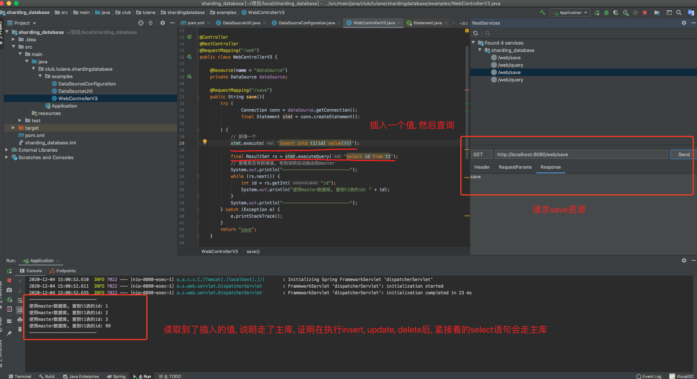
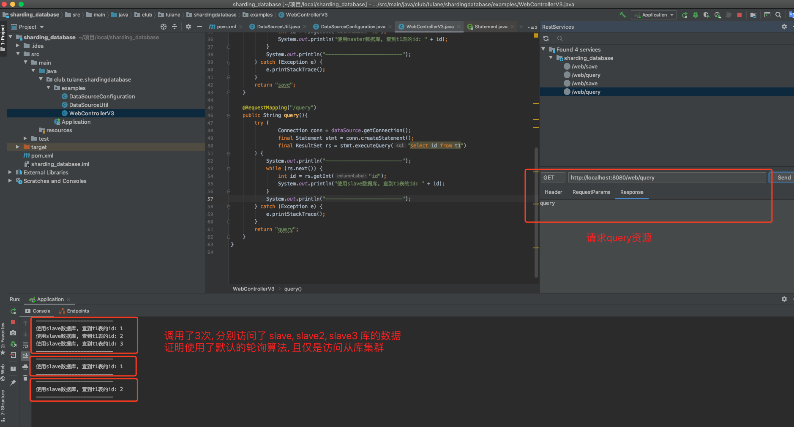

**Week07 作业题目（周六）：**


**3.（必做）读写分离 - 数据库框架版本 2.0**

* 首先 pom.xml 引入 shardingsphere-jdbc

```xml
<dependency>
    <groupId>org.apache.shardingsphere</groupId>
    <artifactId>shardingsphere-jdbc-core</artifactId>
    <version>5.0.0-alpha</version>
</dependency>
```


* 编写一个创建 HikarDataSource 连接池的工具类

```java
package club.tulane.shardingdatabase.examples;

import com.zaxxer.hikari.HikariDataSource;

import javax.sql.DataSource;

public class DataSourceUtil {

    private static final String USER_NAME = "root";

    private static final String PASSWORD = "123";


    public static DataSource createDataSource(final String dataSourceUrl) {
        HikariDataSource result = new HikariDataSource();
        result.setDriverClassName("com.mysql.jdbc.Driver");
        result.setJdbcUrl(String.format("%s?serverTimezone=UTC&useSSL=false&useUnicode=true&characterEncoding=UTF-8", dataSourceUrl));
        result.setUsername(USER_NAME);
        result.setPassword(PASSWORD);
        return result;
    }
}
```


* 编码 DataSource 的 Bean, 使用 ShardingSphere 的 ReplicaQueryDataSourceRuleConfiguration 实现

```java
package club.tulane.shardingdatabase.examples;

import org.apache.shardingsphere.driver.api.ShardingSphereDataSourceFactory;
import org.apache.shardingsphere.replicaquery.api.config.ReplicaQueryRuleConfiguration;
import org.apache.shardingsphere.replicaquery.api.config.rule.ReplicaQueryDataSourceRuleConfiguration;
import org.springframework.context.annotation.Bean;
import org.springframework.context.annotation.Configuration;

import javax.sql.DataSource;
import java.sql.*;
import java.util.*;

@Configuration
public class DataSourceConfiguration {

    private static final String url_master = "jdbc:mysql://127.0.0.1:3316/db";
    private static final String url_slave = "jdbc:mysql://127.0.0.1:3317/db";
    private static final String url_slave_2 = "jdbc:mysql://127.0.0.1:3318/db";
    private static final String url_slave_3 = "jdbc:mysql://127.0.0.1:3319/db";

    @Bean(name = "dataSource")
    public DataSource getDataSource() throws SQLException {
        // 创建主从库数据源连接池
        Map<String, DataSource> dataSourceMap = new HashMap<>();
        dataSourceMap.put("master", DataSourceUtil.createDataSource(url_master));
        dataSourceMap.put("slave", DataSourceUtil.createDataSource(url_slave));
        dataSourceMap.put("slave2", DataSourceUtil.createDataSource(url_slave_2));
        dataSourceMap.put("slave3", DataSourceUtil.createDataSource(url_slave_3));

        // 创建主从配置信息类
        ReplicaQueryDataSourceRuleConfiguration dataSourceConfig = new ReplicaQueryDataSourceRuleConfiguration(
                "master_slave_datasource", "master",
                Arrays.asList("slave", "slave2", "slave3"), null);
        // 创建规则配置类
        ReplicaQueryRuleConfiguration ruleConfig = new ReplicaQueryRuleConfiguration(
                Collections.singleton(dataSourceConfig), Collections.emptyMap());

        // 工厂获得数据源
        return ShardingSphereDataSourceFactory.createDataSource(dataSourceMap, Collections.singleton(ruleConfig), new Properties());
    }
}
```


* 编写测试的 Web 入口

```java
package club.tulane.shardingdatabase.examples;

import org.springframework.stereotype.Controller;
import org.springframework.web.bind.annotation.RequestMapping;
import org.springframework.web.bind.annotation.RestController;

import javax.annotation.Resource;
import javax.sql.DataSource;
import java.sql.Connection;
import java.sql.ResultSet;
import java.sql.Statement;

@Controller
@RestController
@RequestMapping("/web")
public class WebControllerV3 {

    @Resource(name = "dataSource")
    private DataSource dataSource;

    @RequestMapping("/save")
    public String save(){
        try (
                Connection conn = dataSource.getConnection();
                final Statement stmt = conn.createStatement();

        ) {
            // 新增一个
            stmt.execute("insert into t1(id) value(99)");

            final ResultSet rs = stmt.executeQuery("select id from t1");
            // 查看是否有新增值, 有则说明自动路由到master
            System.out.println("--------------------------");
            while (rs.next()) {
                int id = rs.getInt("id");
                System.out.println("使用master数据库, 查到t1表的id: " + id);
            }
            System.out.println("--------------------------");
        } catch (Exception e) {
            e.printStackTrace();
        }
        return "save";
    }

    @RequestMapping("/query")
    public String query(){
        try (
                Connection conn = dataSource.getConnection();
                final Statement stmt = conn.createStatement();
                final ResultSet rs = stmt.executeQuery("select id from t1")
        ) {
            System.out.println("--------------------------");
            while (rs.next()) {
                int id = rs.getInt("id");
                System.out.println("使用slave数据库, 查到t1表的id: " + id);
            }
            System.out.println("--------------------------");
        } catch (Exception e) {
            e.printStackTrace();
        }
        return "query";
    }
}
```


* 测试结果如下:



