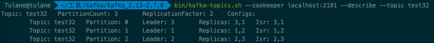
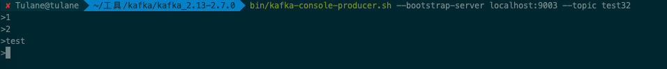
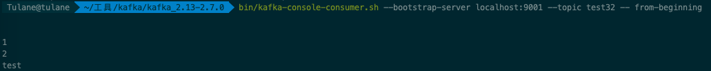
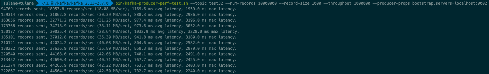
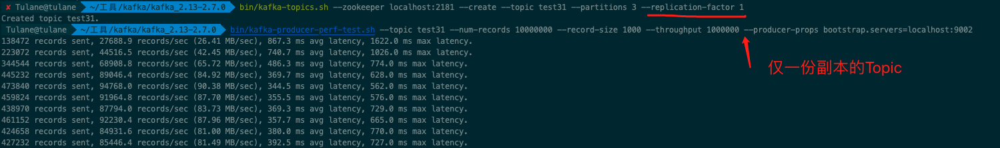
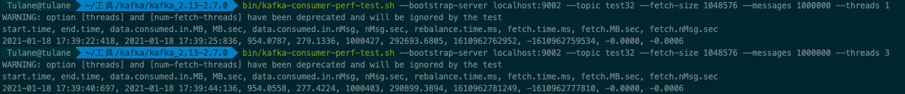

**Week13 作业题目：**

**周四作业：**
**1.（必做）**搭建 ActiveMQ 服务，基于 JMS，写代码分别实现对于 queue 和 topic 的消息生产和消费，代码提交到 github。

链接: 


**周六作业：**
**1.（必做）**搭建一个 3 节点 Kafka 集群，测试功能和性能；实现 spring kafka 下对 kafka 集群的操作，将代码提交到 github。


**搭建一个 3 节点 Kafka 集群:**

1. 启动 Zookeeper

2. 修改配置文件 vim config/server.properties 

```shell
broker.id=1 ## 三个文件分别改为1,2,3
log.dirs=/tmp/kafka/kafka-logs1 ## 三个文件分别改为logs1, logs2, logs3
listeners=PLAINTEXT://localhost:9001 ## 三个文件分别改为9001, 9002, 9003
```

3. 可选: 清理 Zookeeper 的节点, 仅保留 zookeeper 
4. 可选: 清理 Kafka 日志
5. 启动多个 Kafka: bin/kafka-server-start.sh kafka900X.properties 


**测试功能**:

创建多副本 Topic:




生产端




消费端




**测试性能:**

生产端



这里的性能表现不如单节点时, 应该是有副本的原因




用一份副本的Topic做同样测试, 性能好很多


消费端



用时3~4秒左右


**实现 spring kafka 下对 kafka 集群的操作**

链接: 